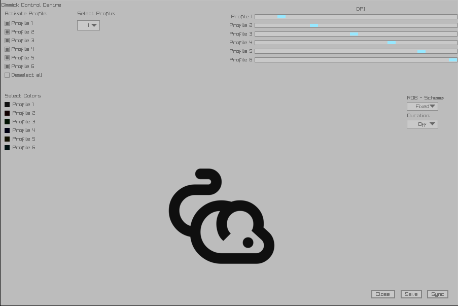

# Gimmick controls for a cheap chinese "Gaming mouse" (Fantech ThorX9 but should work on all Fantech mice)

## Description:

product id differs you may use lsusb to find it out.
Add yourself to the plugdev user to access commands without sudo.

## Dependencies For:
- cli: stdio.h, stdlib.h, stdint.h, string.h, unistd.h (which are standard-libc), libusb-1.0
- Gui: Same as the above but also raygui.h and raylib.h.

## Recommended After Installation:

After completing the compilation you should copy the example-config.csv to ~/.config/gimmicks.csv,
and sync the mouse on startup or you may write your own daemon to sync it everytime you connect it to the machine.

## udev rule:

sudo usermod -aG plugdev $USER
sudo vim /etc/udev/rules.d/99-fantech-x9.rules 
then paste :-

SUBSYSTEM=="usb", ATTR{idVendor}=="18f8", ATTR{idProduct}=="0fc0", MODE="0660", GROUP="plugdev"

## Warning:
The ui may not be as reliable as changing the ~/.config/gimmicks.csv yourself, as this is the first gui I have ever written.

## Ui Demo
-

## References
-[Awesome Python version](https://github.com/GuessWhatBBQ/FantechX9ThorDriver)
-[Libusb](https://libusb.sourceforge.io/api-1.0/)

## Special Thanks to 
-[GuessWhatBBQ](https://github.com/GuessWhatBBQ) for going through the trouble of reverse engineering this mouse.
-[Raysan](https://github.com/raysan5/raylib) for writing this awesome library.

## License

See [license](./license) for full license and warranty disclaimer.
Copyright (C) 2026 Sandesh Paudel
